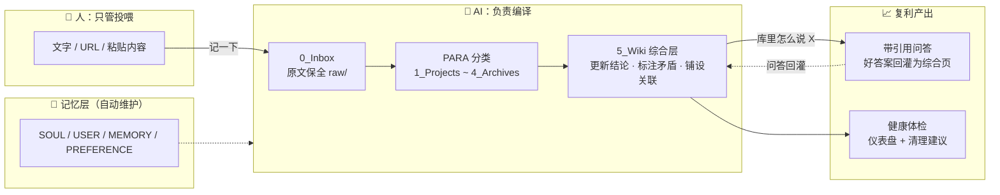

# AI 效能知识库

基于 Obsidian Vault + AI Agent 的个人知识管理系统。人只管投喂，AI 负责编译：你把知识丢进来，AI 不只是整理归档，还会把每个新来源编译进持续复利的综合层——更新结论、标注矛盾、越用越强。

## 架构总览



> 核心循环：**投喂 → 编译 → 提问 → 回灌**。每个新来源都会强化或挑战已有结论，矛盾显式标注、绝不静默覆盖（参考 Karpathy《LLM Wiki》模式）。提问和投喂一样参与复利。

## 特性

- **PARA + Wiki 双层体系** — PARA 负责"东西放哪"，5_Wiki 综合层负责"东西们加起来意味着什么"
- **知识复利** — 每个新来源触发编译：强化或挑战已有结论，矛盾显式标注，绝不静默覆盖
- **问答回灌** — 基于库内知识带引用作答，好答案存为综合页，提问和投喂一样参与复利
- **原文保全** — 入库先存原文全文到 raw 区，摘要理解错了随时可回溯重编译
- **AI 驱动** — 10 个 Skill 覆盖全生命周期：入库、分类、编译、问答、体检、调研、绘图
- **零门槛** — 支持文字、URL、粘贴内容任意输入格式
- **双引擎兼容** — 同时支持 Claude Code 和 Codex

## 快速开始

### 前置条件

- 已安装 [Claude Code](https://docs.claude.com/en/docs/claude-code) 或 Codex CLI（二选一即可）
- （可选）[Obsidian](https://obsidian.md/) — 用于浏览和手动编辑知识库，非必需

### 三步启动

```bash
# 1. 克隆知识库
git clone https://github.com/AndyClouder/ai-efficiency-vault.git
cd ai-efficiency-vault

# 2. 启动 AI 引擎（在知识库根目录下）
claude        # 或 codex

# 3. 对 AI 说：
帮我上手
```

首次运行"帮我上手"时，AI 会自动检测知识库状态、引导你填写身份信息（写入 `USER.md`），并演示核心能力。Skills 位于 `0_系统配置/.claude/skills/`（Codex 对应 `.agents/skills/`），启动时自动加载，无需手动配置。

之后的日常使用只有一个动作：把知识丢进来。

## 目录结构

```
0_Inbox/           ← 新知识落点（raw/ 子目录为原文存证区）
1_Projects/        ← 有截止日期的项目
2_Areas/           ← 持续关注的领域
3_Resources/       ← 参考资料
4_Archives/        ← 归档
5_Wiki/            ← 综合层：实体页/概念页/论点页/问答页（AI编译维护的复利资产）
0_系统配置/         ← 系统配置、记忆、INDEX.md（内容目录）、LOG.md（时间线）
```

## 常用口令

| 你说 | AI 做 |
|------|------|
| "帮我上手" | 新用户引导：检测状态、填写身份、演示能力 |
| "记一下 xxx" | 原文保全 + 结构化存入 Inbox |
| "整理一下" | 扫描 Inbox，逐条提出 PARA 分类建议 |
| "编译一下" | 把新笔记编译进 5_Wiki 综合层，更新结论、标注矛盾、铺设关联 |
| "库里怎么说 X" | 基于知识库带引用作答，好答案回灌为综合页 |
| "看下状态" / "体检" | 一次扫描：健康仪表盘 + 分级清理建议 |

## 记忆系统

AI 在协作中自动学习你的偏好，持续更新以下文件：

| 文件 | 用途 |
|------|------|
| `SOUL.md` | AI 的性格内核（用户定义） |
| `USER.md` | 你的档案（AI 自动维护） |
| `MEMORY.md` | 长期记忆（AI 自动维护） |
| `PREFERENCE.md` | 知识偏好（AI 自动维护） |

## License

MIT
